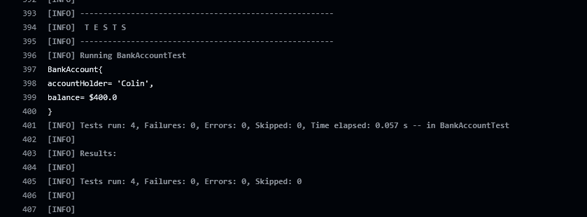
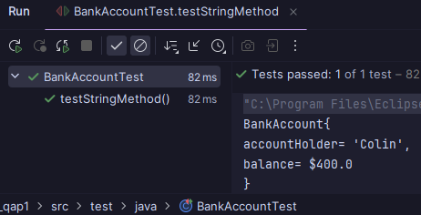

# SDAT DevOPs QAP1
## Code explanation
### Bank Account (BankAccount.java)
- ```java
    private final String accountHolder;
    private double balance; 
  ```
  - This sets the `accountHolder` name and integer `balance`
- ```java
    public BankAccount(String accountHolder, double initialBalance) {

        this.accountHolder = accountHolder;
        this.balance = initialBalance;

        if (initialBalance < 0) {
            throw new IllegalArgumentException("Initial balance cannot be below 0.");
        }
    }
    ```
    - This sets the `initialBalance` and checks if its above `0`
    - This also assigns the name dynamically
- ```java
    public String getAccountHolder() {
        return accountHolder;
    }

    public double getBalance() {
        return balance;
    }
    ```
  - This is where I get the name and the balance back
- ```java
    public void deposit(double amount) {
        if (amount < 0) {
            throw new IllegalArgumentException("Deposit amount must be above 0.");
        }
        balance += amount;
    }

    public void withdraw(double amount) {
        if (amount <= 0) {
            throw new IllegalArgumentException("Withdraw must be at least 0.01");
        }
        if (amount > balance) {
            throw new IllegalArgumentException("Not enough funds.");
        }
        balance -= amount;
    }
    ```
  - This is pretty basic math, where i add and remove amounts provided in the tests.
  - This also throws an error if conditions are met.
- ```java
    @Override
    public String toString() {
        return "BankAccount{\n" +
        "accountHolder= '" + accountHolder + '\'' +
        ", \nbalance= $" + balance +
        "\n}";
        }
    ```
  - This is an override method of a toString method that prints out the account for testing.
### Unit tests (BankAccountTest.java)
- ```java
    public BankAccount account;

    @BeforeEach
    void setUp() {
        account = new BankAccount("Colin", 400);
    }
    ```
  - This is where I set my new account object
  - This uses the `@` annotation for setting this object up before each run of tests
  - This ensures there is always an account
- ```java
    @Test
    void testIniBal() {
        assertEquals(400, account.getBalance());
    }
    ```
  - This `@` annotation sets the block for tests
  - This is where I test the `getBalance()` method against the default `400` value
- ```java
     @Test
    void testDeposit() {
        account.deposit(5.0);
        assertEquals(405, account.getBalance());
    }
    ```
  - this is where I test a `double` input value
  - this test runs the `deposit()` method
  - you need the default value to equal the `deposit()` + `getBalance()`
- ```java
     @Test
    void testWithdraw() {
        account.withdraw(200);
        assertEquals(200, account.getBalance());
    }
    ```
  - this is where I test the `withdraw()` method
  - this tests the default value against the `withdraw()`
  - should output the difference
- ```java
    @Test
    void testStringMethod() {
        String result = account.toString();

        assertTrue(result.contains(account.getAccountHolder()));
        assertTrue(result.contains(String.valueOf(account.getBalance())));
        System.out.println(account.toString());
    }
    ```
  - This is an additional test where I wanted to test dynamic inputs
  - This converts the `getBalance()` method to a string and compares it to a boolean
  - This checks that the `getAccountHolder()` returns a real value and is not empty
## Screenshots
> This is the GitHub actions running


> This is the `testStringMethod()` running

